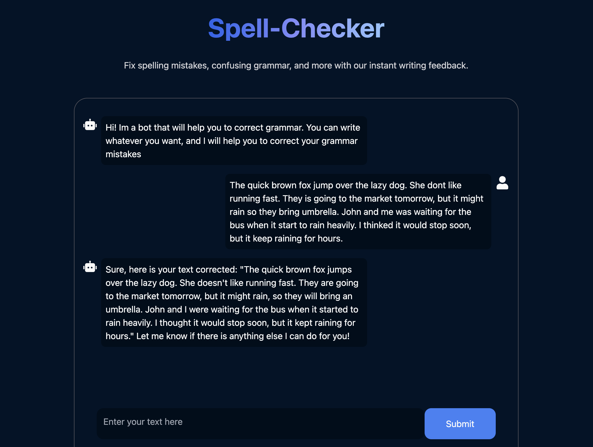

# Spell Check Tool

Spell Check Tool es una aplicación que detecta errores gramaticales y de idioma, y los corrige utilizando la inteligencia artificial de Cohere.

## Características

- Detectar el idioma del texto ingresado.
- Identificar y corregir errores gramaticales.
- Interfaz amigable y fácil de usar.
- Correcciones precisas y rápidas gracias a la IA de Cohere.



## Tecnologías Utilizadas

- **React**: Biblioteca de JavaScript para construir interfaces de usuario.
- **Cohere AI**: Plataforma de IA utilizada para detectar y corregir errores gramaticales.
- **React Icons**: Biblioteca de iconos para React.
- **Tailwind CSS**: Framework de CSS para estilos rápidos y responsivos.

## Requisitos Previos

Antes de comenzar, asegúrate de tener instalado lo siguiente en tu máquina:

- Node.js (v14 o superior)
- npm (v6 o superior) o Yarn (opcional)

## Instalación

1. **Clonar el repositorio:**

   ```sh
   git clone https://github.com/martinnbejarano/spell-check-tool.git
   cd spell-check-tool
   ```

2. **Configurar Variables de Entorno:**

   Crea un archivo `.env.local` en la raíz del proyecto y agrega la variable de entorno de la api key de cohere:

   ```env
   VITE_COHERE_API_KEY=XXXXXXXXX
   ```

3. **Ejecucion:**
   ```sh
   npm run dev
   ```
